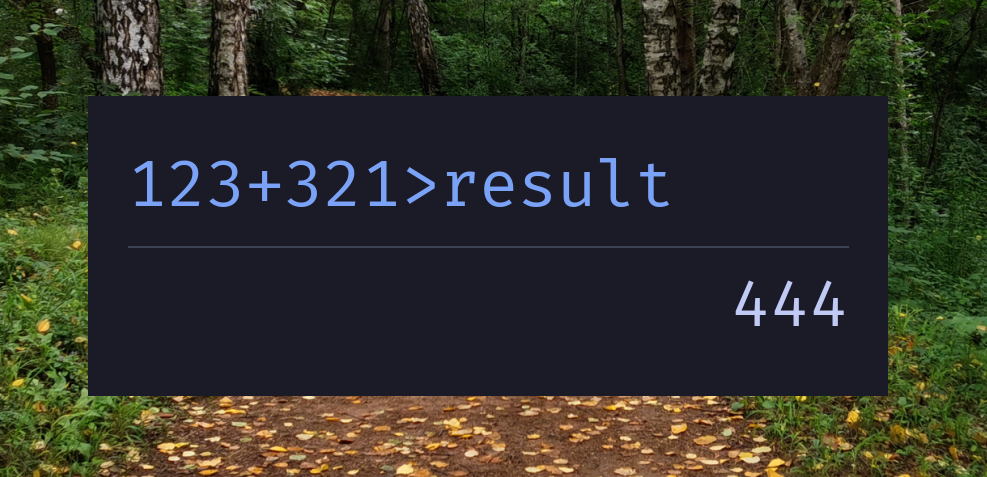

# 📘 HOWTO: Use SmartCalc

This guide explains how to install, run, and use the **SmartCalculator**
application effectively.

---

## 📦 1. Prerequisites

Make sure you have:

- Python 3.10 or newer
- [Pygame](https://www.pygame.org/news) installed:

  ```bash
  uv add pygame
  # or
  pip install pygame
```



---

## 🖋️ 2. Font Setup (Optional but Recommended)

For best visuals and symbol support, use **FiraCode Nerd Font**.

It is provided in fonts/ directory for your convenience.

---

## 🚀 3. Running the Calculator

From your terminal:

```bash
uv tool install smartcalc  # this installs it and makes it available
calc  # will run the app.
```

A compact, stylish calculator window will open.

---

## ⌨️ 4. Basic Usage

Type expressions directly into the window and press `Enter` to evaluate.

Examples:

```text
2 + 2         → 4
a = 10        → stores value in variable a
a * 2         → 20
5 >> sum      → adds 5 to sum (creates if 'sum' is missing)
3 + 4 > res   → will create 'res' or rewrite 'res' if it exists.
```

---

## 🔁 5. Reuse Previous Inputs

Use the arrow keys to cycle through your session history:

* `↑` to recall previous commands
* `↓` to go forward or clear

---

## 🎨 6. Themes

Press **`T`** to toggle between:

* **Dark mode** (Tokyo Night default)
* **Light mode** (soft paper background)

---

## 💡 7. Tips & Tricks

* Use `_` to access the last result:

  ```text
  2 + 3
  _ * 4    → 20
  ```
* Variables persist throughout the session.
* You can format long numbers:

  ```text
  1000000 + 999999  → 1_999_999
  ```

---

## 🧪 8. Debugging & Errors

If something goes wrong:

* You'll see a red-colored error message.
* Recheck your syntax.
* If it's a crash: try running from the terminal to see logs.

---

## 🧼 9. Exiting the Program

Just close the window or press `Ctrl + C` in the terminal where it's running.

---

## 🙌 10. Getting Involved

Feel free to:

* Modify the code
* Submit improvements or suggestions
* Add new features like scrollback, functions, or themes

---

Enjoy SmartCalc — fast, minimal, and truly keyboard-first! 🧠⌨️🖥️

